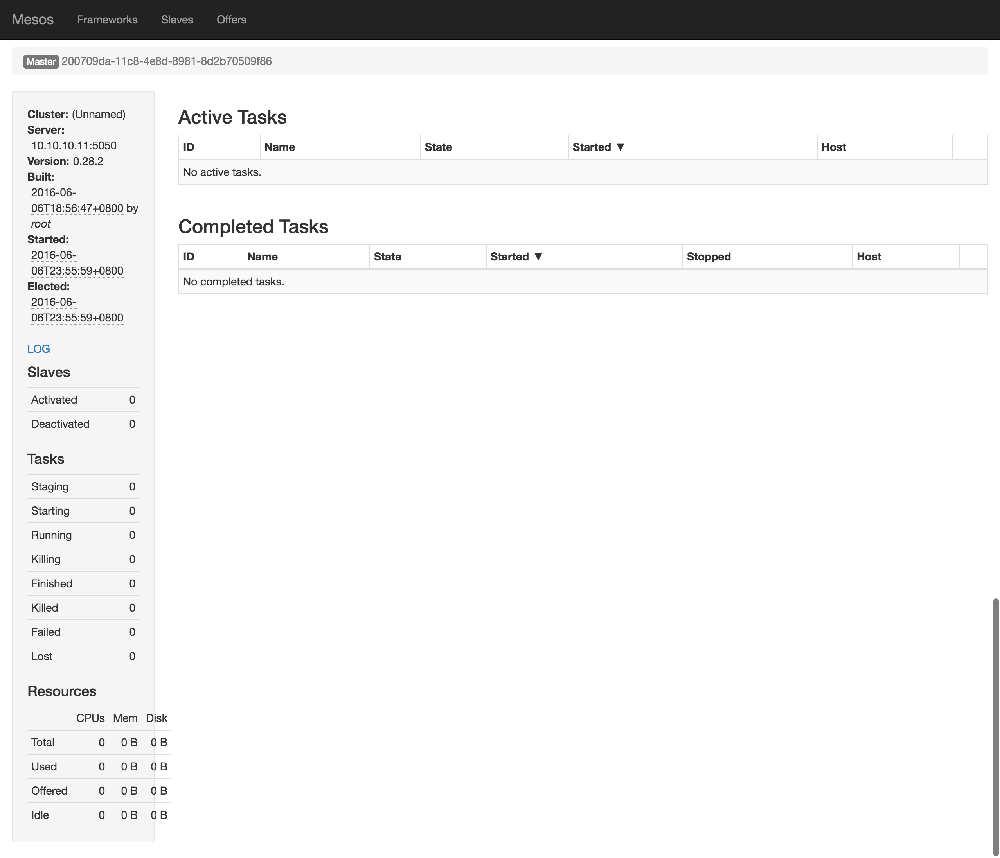

# Mesos Introduction

Apache Mesos，一個開放原始碼軟體專案，是一種叢集電腦管理工具，由加州大學柏克萊分校開發。能夠將資料中心電腦系統中的CPU、記憶體、儲存裝置以及其他運算資源，全部加以虛擬化，並進行管理。

## Why Mesos

http://dockone.io/article/686

## Mesos Architecture

    (1)    Mesos-master：Mesos master，主要負責管理各個framework和slave，並將slave上的資源分配给各個framework
    (2)    Mesos-slave(agent)：Mesos slave，負責管理本节点上的各個mesos-task，例如：為各個executor分配资源
    (3)    Framework：如：Hadoop，Spark等，通過MesosSchedulerDiver接入Mesos
    (4)    Executor：安装到mesos-slave上，用於啟動Framework中的task。
    
## Example of resource offer

    - Slave 1向Master汇报其空闲资源：4个CPU、4GB内存。然后，Master触发分配策略模块，得到的反馈是Framework 1要请求全部可用资源。
    - Master向Framework 1发送资源邀约，描述了Slave 1上的可用资源。
    - Framework的调度器（Scheduler）响应Master，需要在Slave上运行两个任务，第一个任务分配<2 CPUs, 1 GB RAM>资源，第二个任务分配<1 CPUs, 2 GB RAM>资源。
    - 最后，Master向Slave下发任务，分配适当的资源给Framework的任务执行器（Executor）,接下来由执行器启动这两个任务（如图中虚线框所示）。 此时，还有1个CPU和1GB的RAM尚未分配，因此分配模块可以将这些资源供给Framework 2。
    
## Mesos Installation

### Master NODE

    - OS:Ubuntu-14.04
    - Java:Open-JDK-1.7.0_101
    - Mesos-0.28
    - VirtualBox 5.0.20
    - master_ip = 10.10.10.11
    - hostname:master
    
依照[官網安裝](http://mesos.apache.org/gettingstarted/)步驟進行安裝

>**Note**:Mesos之後1.0版本Slave改為Agent,因此0.28版本啟動指令為./bin/mesos-slave.sh --master=master_ip:5050

管理介面:http://master_ip:5050

### Slave NODE

    - OS:Ubuntu-14.04
    - Java:Open-JDK-1.7.0_101
    - Mesos-0.28
    - VirtualBox 5.0.20
    - master_ip = 10.10.10.13
    - hostname:slave
    
使用VirtualBox再製功能複製master vm,並修改IP跟hostname  
依照[此篇文章進行](http://blog.csdn.net/u014729236/article/details/46426185)mesos cluster設定

>**Note**:不要使用文章中的./mesos-start-cluster.sh啟動環境
>**Note**:master啟動指令:./bin/mesos-master.sh --ip=master_ip --work_dir=/var/lib/mesos
>**Note**:slave啟動指令(在slave node中啟動):./bin/mesos-agent.sh --master=master_ip:5050

管理介面會看到slave可用資源:http://master_ip:5050

