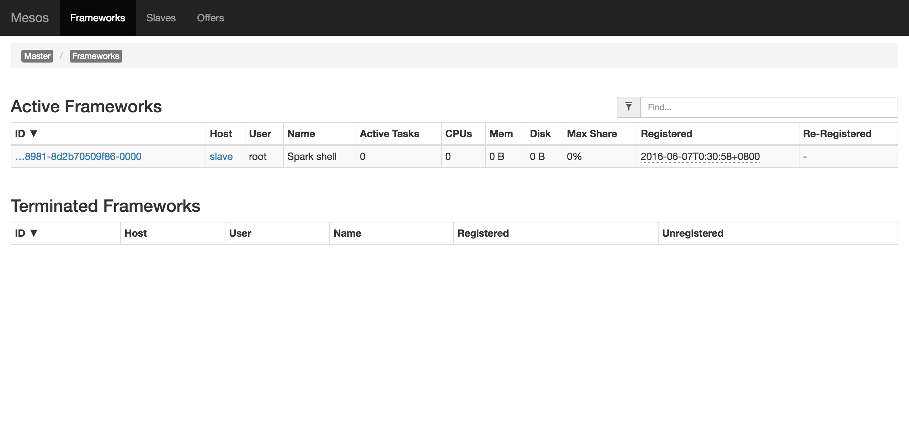

# Spark Intrdution

Spark是叢集運算系統，使用了記憶體內運算技術，能在資料尚未寫入硬碟時即在記憶體內分析運算。

Spark可搭配叢集管理系統及分散式儲存使用

叢集管理系統:

    - Hadoop YARN
    - Apache Mesos
分散式儲存:

    - HDFS
    - Cassandra
    - OpenStack Swift
    - Amazon S3
    
### Resilient Distributed Dataset (RDD)

Spark 核心概念是 Resilient Distributed Dataset (RDD) ，是由AMPLab實驗室所提出的概念，類似一種分散式的記憶體。而且，RDD是一種可跨群集（cluster）被使用、可儲存於主記憶體中的immutable的物件集合。是一個容錯的，並行的資料結構。

Spark 支援任何一個 Hadoop 的文件系統建立分布式資料集，例如，HDFS，Cassandra，HBase，Amazon S3等。此外， Spark 也支援文字文件(text files)，SequenceFiles 和其他 Hadoop InputFormat。

RDD共有兩種操作:

- Transformation

        其操作結果為新的RDD，意即其作用在於將RDD再轉換生成另一個RDD。
- Action

        在RDD之上進行計算之後，將其結果返回 Spark 的驅動程序，或寫至檔案系統。

# Spark Install

    - OS:Ubuntu-14.04
    - Java:Open-JDK-1.7.0_101
    - Mesos-0.28
    - scala-2.11.8
    - spark-1.6
    - VirtualBox 5.0.20
    - master_ip = 10.10.10.13
    - hostname:slave

根據[此篇文章](http://amberfu.blogspot.tw/2016/05/ubuntu-1404-scalaspark.html)在slave node上安裝spark

# Spark on Mesos

依據之前[步驟](https://github.com/RandyPanGit/bigdata/blob/master/Mesos.md)安裝完mesos cluster

再依據[此篇文章](http://yenyu-lovelan.blogspot.tw/2015/10/mesos-for-spark-running-on-cent-os-63.html)進行spark跟mesos相關設置

>**Note** spark-shell啟動:spark-shell --master mesos://master_ip:5050

完成安裝後可在mesos管理介面看到Framework頁面看到相關資訊

